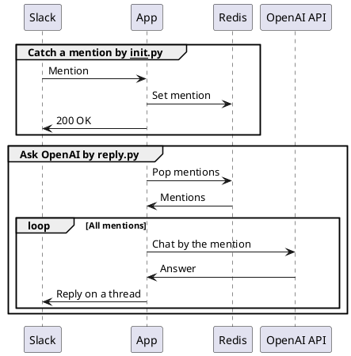

# What is this

メンションを飛ばすと OpenAI の API を使って返信をしてくれる Slack ボットの最小サンプルです。
Slack からの HTTP リクエストは3秒以内にレスポンスしなければなりませんが、OpenAI の API はレスポンスが返ってくるまで数十秒かかることもあります。
そのため、Slack からのリクエストボディは Redis に保存してすぐに `200 OK` を返しています。
`reply.py` を実行することで Redis に保存されているメッセージを OpenAI に送信し、レスポンスをスレッドに返信します。

# Sequence

